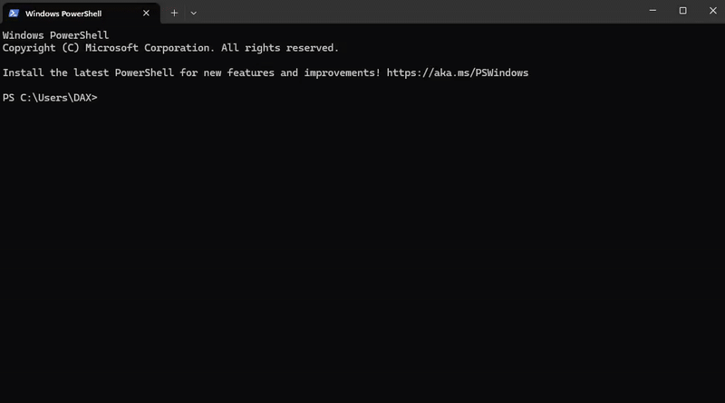
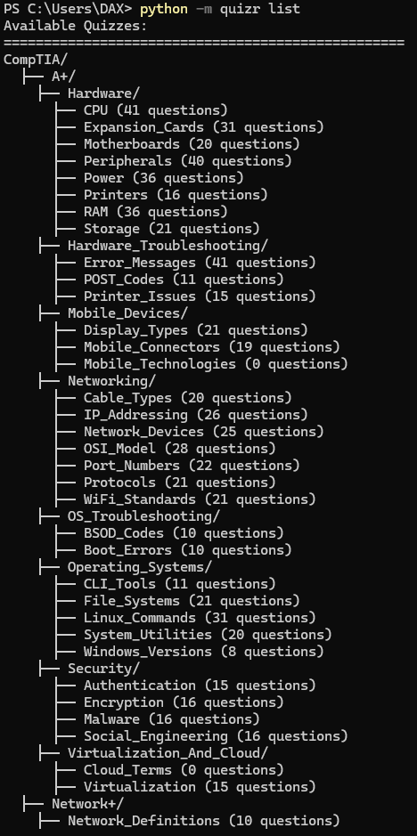
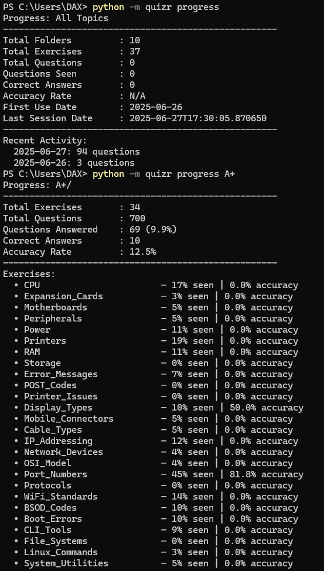

# QUIZR

[](https://badge.fury.io/py/quizr-cli)
[](http://creativecommons.org/publicdomain/zero/1.0/)
[](https://www.python.org/downloads/)
[](https://aur.archlinux.org/packages/python-quizr-cli/)

QUIZR is a fast, minimal command-line quiz engine for focused learning. It uses spaced repetition to strengthen memory, supports image-based questions, and organizes content in clean YAML files. Built-in answer evaluation includes 90% fuzzy matching for definitions and longer responses and tracks your progress automatically.

## Preview

[](quizr/Resources/Preview.mp4)

## Installation

### From PyPI
```bash
pip install quizr-cli
```

### From AUR (Arch Linux)
Using an AUR helper like `yay` or `paru`:
```bash
yay -S python-quizr-cli
# or
paru -S python-quizr-cli
```

### Manual Installation

**Windows:**
```bash
.\install.bat
```

**Mac/Linux:**
```bash
chmod +x install.sh
./install.sh
```

For development:
```bash
git clone https://github.com/sipistab/QUIZR.git
cd QUIZR
pip install -r requirements.txt
pip install -e .
```

## Commands

File and folder names are strictly case-sensitive. You can reference the preview and note that running the start command with port_numbers throws an error while Port_Numbers start the exercise correctly.

### List Available Quizzes
```bash
python -m quizr list
```
Lists all quizzes with their question counts in a hierarchical view.
##### Example Output


### Start Quiz
```bash
python -m quizr start <target> [mode]
```

Modes:
- `spaced` (default) - Uses spaced repetition algorithm
- `shuffle` - Randomizes all questions
- `quick` - Random subset of 10 questions

Examples:
```bash
python -m quizr start network+          # All Network+ quizzes in spaced mode
python -m quizr start comptia quick     # Quick mode for CompTIA folder
python -m quizr start Port_Numbers      # Specific quiz in spaced mode
```
##### Example Output


### View Progress
```bash
python -m quizr progress [target]       # Global stats if no target
python -m quizr progress network+       # Stats for Network+ folder
python -m quizr progress port_numbers   # Stats for specific quiz
```

### Exit Session
Type any of: `quit`, `abort`, `!quit`, `!abort`, `#quit`, `#abort`

## Quiz File Format

Questions are defined in YAML files in the Exercises folder. Each question requires a unique ID and must include `prompt` and `answer`. Images and strict matching are optional.

```yaml
q_001:
  prompt: "What is the default port for HTTP?"
  answer: "80"
  strict: true  # Disables fuzzy matching for this question

q_002:
  prompt: "What protocol uses port 443?"
  answer: "HTTPS"
  # Fuzzy matching enabled (90% threshold)

q_003:
  image: "diagram1.png"  # Must exist in /images
  prompt: "What port is used for SSH in this diagram?"
  answer: "22"
```

## Directory Structure
```
QUIZR/
├── images/                    # Required for image questions
│   └── diagram1.png          # Use non-descriptive names
├── Exercises/
	├── CompTIA/                  # Example organization
	│   ├── Network+/
	│   │   ├── Port_Numbers.yaml
	│   │   └── Protocols.yaml
	│   └── Security+/
	│       └── Cryptography.yaml
	└── progress.yaml             # Auto-generated progress data
```

## Progress Tracking

Progress is stored in `progress.yaml` with this structure:
```yaml
__meta__:
  total_questions_seen: 45
  total_reviews: 102
  first_use: "2024-03-21"
  last_session: "2024-03-21"
  daily_log:
    "2024-03-21": 32

CompTIA:
  Network+:
    Port_Numbers.yaml:
      q_001:
        attempts: 3
        correct: 2
        last_review: "2024-03-21"
        last_correct: "2024-03-21"
```

## Implementation Details

### Spaced Repetition
- Questions are scheduled based on performance history
- Never-seen questions get highest priority
- Correct answers increase review interval
- Failed questions return to the queue sooner

### Answer Evaluation
- Case-insensitive exact matching
- Fuzzy matching with 90% threshold (configurable in a per question bases via strict: true in yaml)
- Immediate feedback with correct answers

### Image Questions
- Images must be in `/images` directory
- Use non-descriptive filenames
- Opens with system default viewer
- Continues after image is closed

## Why I Created This

I have always regarded the command line as the most efficient and principled form of interaction. Graphical interfaces often introduce unnecessary friction, demanding more attention than the task requires. The terminal, by contrast, offers clarity, speed, and control.

While attempting to memorize port numbers within Neovim, I became aware of the inefficiency in the process. The repetition was scattered, the pacing irregular, and the feedback inconsistent. I required a tool that could support deliberate, focused practice without compromise. That is why I created this program.

It was built initially for my own use, particularly to achieve complete retention of CompTIA A+ concepts. (This is why you will my ComptiA A+ preparation questions already boundled.) However, the tool is general in design and freely available. You are encouraged to use it, modify it, and distribute it as you see fit. If you wish to contribute question sets or support further development, I welcome your involvement.

— Stephen

## License

[CC0 1.0 Universal](https://creativecommons.org/publicdomain/zero/1.0/)